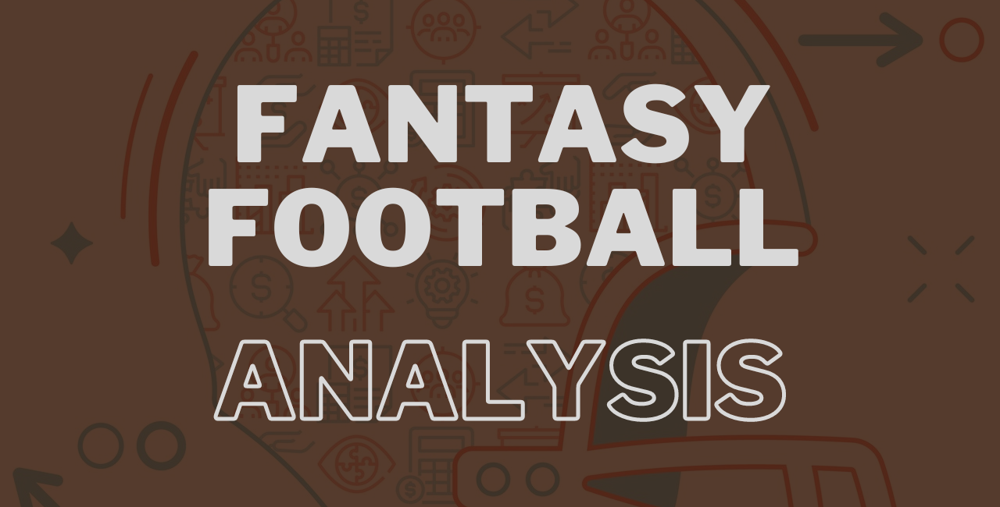

  <!--  -->

  

  

  

  

  

  </a>

A place where I share insights about NFL/Fantasy Football in a variety of formats:
- Daily notebooks
- Visualizations
- Tables
- Helpful scripts

With the aim of learning SQL, Python, data visualization techniques, statistical analysis/modeling, and reporting through my passion for NFL and Fantasy Football. 
  
